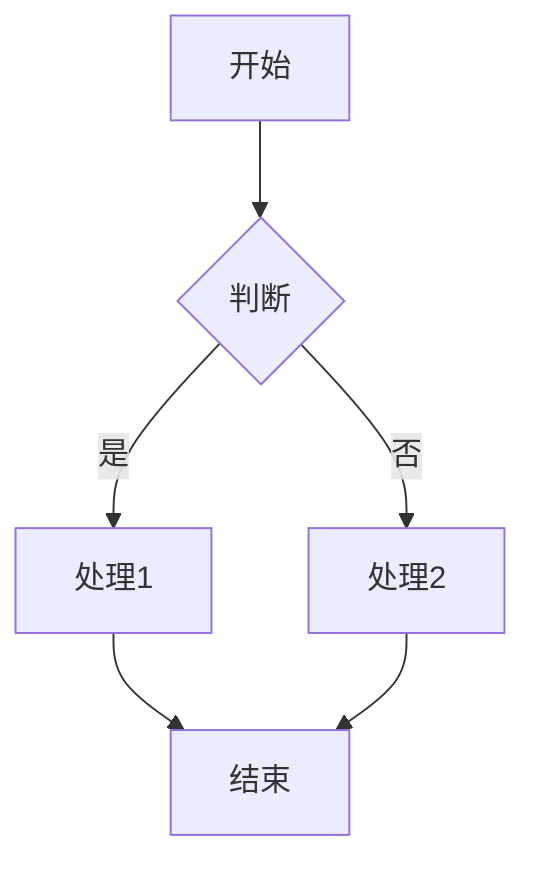
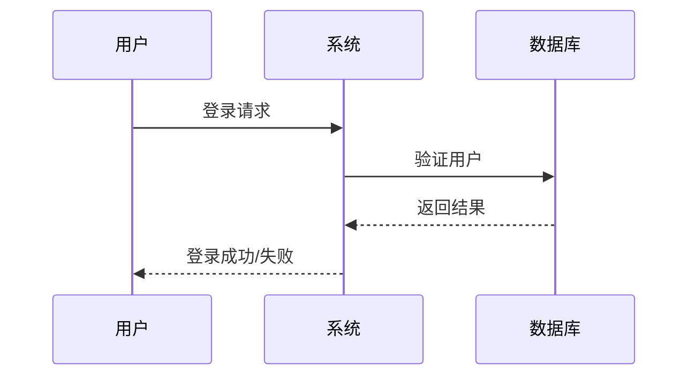
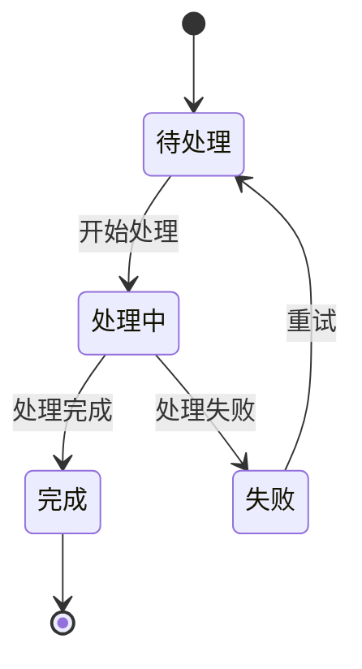
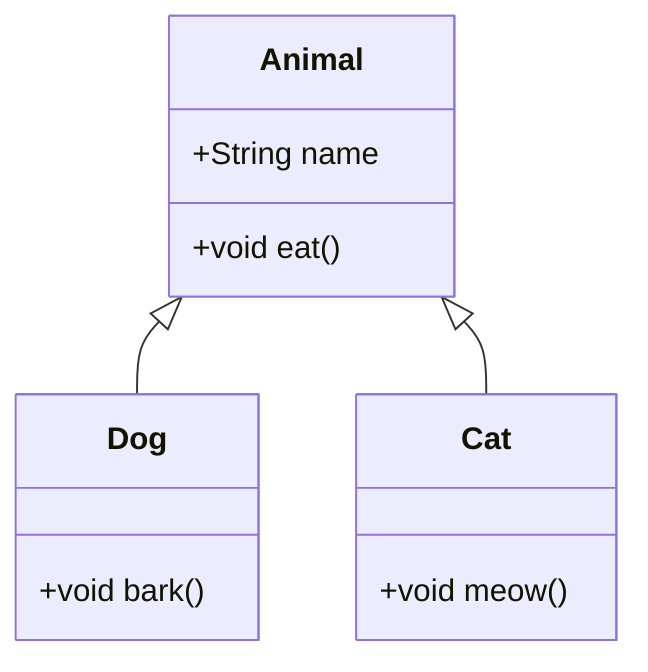
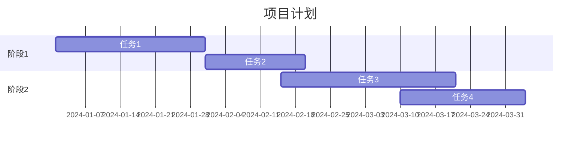
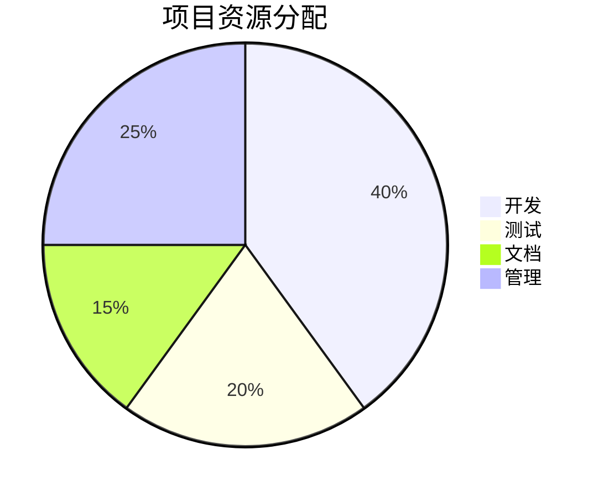
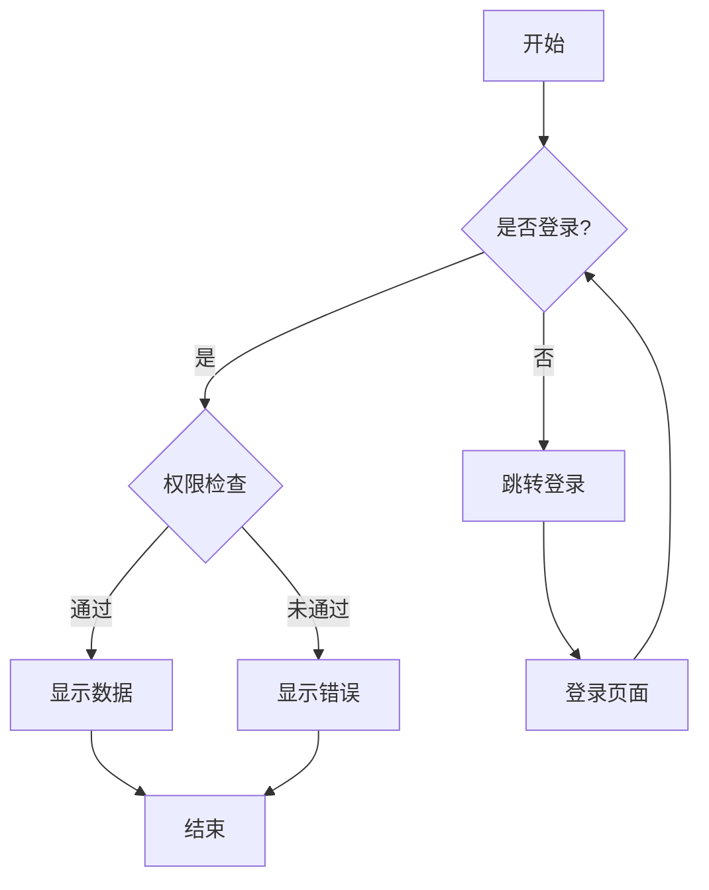

# 流程图测试

## 基础流程图

```mermaid
graph TD
    A[开始] --> B{判断}
    B -- 是 --> C[处理1]
    B -- 否 --> D[处理2]
    C --> E[结束]
    D --> E
```

## 时序图

```mermaid
sequenceDiagram
    participant 用户
    participant 系统
    participant 数据库
    
    用户->>系统: 登录请求
    系统->>数据库: 验证用户
    数据库-->>系统: 返回结果
    系统-->>用户: 登录成功/失败
```

## 状态图

```mermaid
stateDiagram-v2
    [*] --> 待处理
    待处理 --> 处理中: 开始处理
    处理中 --> 完成: 处理完成
    处理中 --> 失败: 处理失败
    失败 --> 待处理: 重试
    完成 --> [*]
```

## 类图

```mermaid
classDiagram
    class Animal {
        +String name
        +void eat()
    }
    class Dog {
        +void bark()
    }
    class Cat {
        +void meow()
    }
    Animal <|-- Dog
    Animal <|-- Cat
```

## 甘特图

```mermaid
gantt
    title 项目计划
    dateFormat  YYYY-MM-DD
    section 阶段1
    任务1           :a1, 2024-01-01, 30d
    任务2           :after a1, 20d
    section 阶段2
    任务3           :2024-02-15, 35d
    任务4           :2024-03-10, 25d
```

## 饼图

```mermaid
pie title 项目资源分配
    "开发" : 40
    "测试" : 20
    "文档" : 15
    "管理" : 25
```

## 复杂流程图

```mermaid
graph TD
    A[开始] --> B{是否登录?}
    B -- 是 --> C{权限检查}
    B -- 否 --> D[跳转登录]
    C -- 通过 --> E[显示数据]
    C -- 未通过 --> F[显示错误]
    D --> G[登录页面]
    G --> B
    E --> H[结束]
    F --> H
``` 